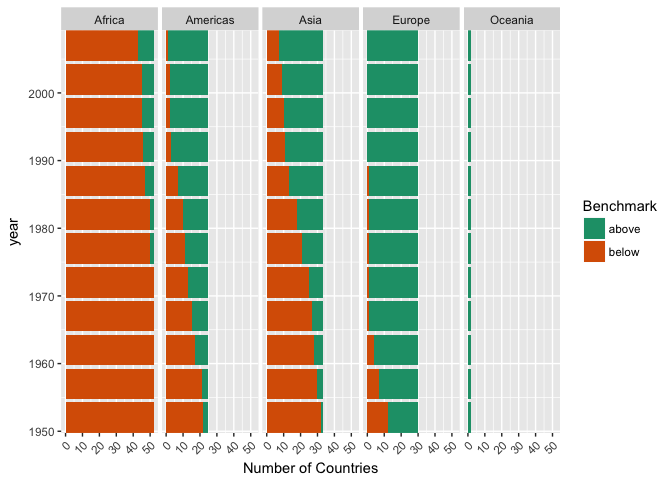

Hw03
================
Abdullah Farouk
2017-09-29

``` r
library(tidyverse)
```

    ## Loading tidyverse: ggplot2
    ## Loading tidyverse: tibble
    ## Loading tidyverse: tidyr
    ## Loading tidyverse: readr
    ## Loading tidyverse: purrr
    ## Loading tidyverse: dplyr

    ## Conflicts with tidy packages ----------------------------------------------

    ## filter(): dplyr, stats
    ## lag():    dplyr, stats

``` r
library(gapminder)
library(stargazer)
```

    ## 
    ## Please cite as:

    ##  Hlavac, Marek (2015). stargazer: Well-Formatted Regression and Summary Statistics Tables.

    ##  R package version 5.2. http://CRAN.R-project.org/package=stargazer

``` r
library(pander)
library(grid)
```

In this exploration of the gapminder dataset I try to carry out the tasks asked of us in class. Of the many listed, here are the 4 I chose to do

Get the maximum and minimum of GDP per capita for all continents.
-----------------------------------------------------------------

<table style="width:58%;">
<colgroup>
<col width="16%" />
<col width="13%" />
<col width="13%" />
<col width="13%" />
</colgroup>
<thead>
<tr class="header">
<th align="center">continent</th>
<th align="center">max_gdp</th>
<th align="center">min_gdp</th>
<th align="center">spread</th>
</tr>
</thead>
<tbody>
<tr class="odd">
<td align="center">Africa</td>
<td align="center">21951</td>
<td align="center">241.2</td>
<td align="center">21710</td>
</tr>
<tr class="even">
<td align="center">Americas</td>
<td align="center">42952</td>
<td align="center">1202</td>
<td align="center">41750</td>
</tr>
<tr class="odd">
<td align="center">Asia</td>
<td align="center">113523</td>
<td align="center">331</td>
<td align="center">113192</td>
</tr>
<tr class="even">
<td align="center">Europe</td>
<td align="center">49357</td>
<td align="center">973.5</td>
<td align="center">48384</td>
</tr>
<tr class="odd">
<td align="center">Oceania</td>
<td align="center">34435</td>
<td align="center">10040</td>
<td align="center">24396</td>
</tr>
</tbody>
</table>


We notice Asia has the largest spread in gdp per capita relative to all other continents. This tells us that their countries have more of an unequal distibution of gains from trade relative to countries in all the other continents.

Look at the spread of GDP per capita within the continents.
-----------------------------------------------------------

Lets investigate this further. To do so lets draw up spaghetti plots for the different continents.

``` r
#Visualizing spread of GDP across continents
spread_gdp_continent <- cpy %>% 
  ggplot(aes(x=year, y = gdpPercap, group = country)) + 
  facet_wrap(~continent) + 
  geom_line(aes(colour = continent), alpha = 0.3, size = 1) + 
  theme(axis.text.x=element_text(angle=45,hjust=1)) + scale_y_log10()
spread_gdp_continent
```


``` r
#tabulating spread 
spread_gdp_continent_table <- cpy %>% 
  group_by(year, continent) %>% 
  summarize_each(funs(min, max), gdpPercap) %>%
  mutate(spread = max - min) %>% 
  split(list(.$continent))
  #select(year, continent, country, gdpPercap)
knitr::kable(spread_gdp_continent_table, align = 'c') #Tried to use pandoc function to tabulate list.
```

<table class="kable_wrapper">
<tbody>
<tr>
<td>
| year | continent |    min   |    max    |   spread  |
|:----:|:---------:|:--------:|:---------:|:---------:|
| 1952 |   Africa  | 298.8462 |  4725.296 |  4426.449 |
| 1957 |   Africa  | 335.9971 |  5487.104 |  5151.107 |
| 1962 |   Africa  | 355.2032 |  6757.031 |  6401.828 |
| 1967 |   Africa  | 412.9775 | 18772.752 | 18359.774 |
| 1972 |   Africa  | 464.0995 | 21011.497 | 20547.398 |
| 1977 |   Africa  | 502.3197 | 21951.212 | 21448.892 |
| 1982 |   Africa  | 462.2114 | 17364.275 | 16902.064 |
| 1987 |   Africa  | 389.8762 | 11864.408 | 11474.532 |
| 1992 |   Africa  | 410.8968 | 13522.158 | 13111.261 |
| 1997 |   Africa  | 312.1884 | 14722.842 | 14410.653 |
| 2002 |   Africa  | 241.1659 | 12521.714 | 12280.548 |
| 2007 |   Africa  | 277.5519 | 13206.485 | 12928.933 |

</td>
<td>
| year | continent |    min   |    max   |  spread  |
|:----:|:---------:|:--------:|:--------:|:--------:|
| 1952 |  Americas | 1397.717 | 13990.48 | 12592.76 |
| 1957 |  Americas | 1544.403 | 14847.13 | 13302.72 |
| 1962 |  Americas | 1662.137 | 16173.15 | 14511.01 |
| 1967 |  Americas | 1452.058 | 19530.37 | 18078.31 |
| 1972 |  Americas | 1654.457 | 21806.04 | 20151.58 |
| 1977 |  Americas | 1874.299 | 24072.63 | 22198.33 |
| 1982 |  Americas | 2011.160 | 25009.56 | 22998.40 |
| 1987 |  Americas | 1823.016 | 29884.35 | 28061.33 |
| 1992 |  Americas | 1456.310 | 32003.93 | 30547.62 |
| 1997 |  Americas | 1341.727 | 35767.43 | 34425.71 |
| 2002 |  Americas | 1270.365 | 39097.10 | 37826.73 |
| 2007 |  Americas | 1201.637 | 42951.65 | 41750.02 |

</td>
<td>
| year | continent | min |    max    |   spread  |
|:----:|:---------:|:---:|:---------:|:---------:|
| 1952 |    Asia   | 331 | 108382.35 | 108051.35 |
| 1957 |    Asia   | 350 | 113523.13 | 113173.13 |
| 1962 |    Asia   | 388 |  95458.11 |  95070.11 |
| 1967 |    Asia   | 349 |  80894.88 |  80545.88 |
| 1972 |    Asia   | 357 | 109347.87 | 108990.87 |
| 1977 |    Asia   | 371 |  59265.48 |  58894.48 |
| 1982 |    Asia   | 424 |  33693.18 |  33269.18 |
| 1987 |    Asia   | 385 |  28118.43 |  27733.43 |
| 1992 |    Asia   | 347 |  34932.92 |  34585.92 |
| 1997 |    Asia   | 415 |  40300.62 |  39885.62 |
| 2002 |    Asia   | 611 |  36023.11 |  35412.11 |
| 2007 |    Asia   | 944 |  47306.99 |  46362.99 |

</td>
<td>
| year | continent |    min    |    max   |  spread  |
|:----:|:---------:|:---------:|:--------:|:--------:|
| 1952 |   Europe  |  973.5332 | 14734.23 | 13760.70 |
| 1957 |   Europe  | 1353.9892 | 17909.49 | 16555.50 |
| 1962 |   Europe  | 1709.6837 | 20431.09 | 18721.41 |
| 1967 |   Europe  | 2172.3524 | 22966.14 | 20793.79 |
| 1972 |   Europe  | 2860.1698 | 27195.11 | 24334.94 |
| 1977 |   Europe  | 3528.4813 | 26982.29 | 23453.81 |
| 1982 |   Europe  | 3630.8807 | 28397.72 | 24766.83 |
| 1987 |   Europe  | 3738.9327 | 31540.97 | 27802.04 |
| 1992 |   Europe  | 2497.4379 | 33965.66 | 31468.22 |
| 1997 |   Europe  | 3193.0546 | 41283.16 | 38090.11 |
| 2002 |   Europe  | 4604.2117 | 44683.98 | 40079.76 |
| 2007 |   Europe  | 5937.0295 | 49357.19 | 43420.16 |

</td>
<td>
| year | continent |    min   |    max   |   spread   |
|:----:|:---------:|:--------:|:--------:|:----------:|
| 1952 |  Oceania  | 10039.60 | 10556.58 |  516.98002 |
| 1957 |  Oceania  | 10949.65 | 12247.40 | 1297.74573 |
| 1962 |  Oceania  | 12217.23 | 13175.68 |  958.45114 |
| 1967 |  Oceania  | 14463.92 | 14526.12 |  62.20572  |
| 1972 |  Oceania  | 16046.04 | 16788.63 |  742.59220 |
| 1977 |  Oceania  | 16233.72 | 18334.20 | 2100.47981 |
| 1982 |  Oceania  | 17632.41 | 19477.01 | 1844.59888 |
| 1987 |  Oceania  | 19007.19 | 21888.89 | 2881.69774 |
| 1992 |  Oceania  | 18363.32 | 23424.77 | 5061.44189 |
| 1997 |  Oceania  | 21050.41 | 26997.94 | 5947.52280 |
| 2002 |  Oceania  | 23189.80 | 30687.75 | 7497.95338 |
| 2007 |  Oceania  | 25185.01 | 34435.37 | 9250.35833 |

</td>
</tr>
</tbody>
</table>
``` r
# #I use the following code to try and plot the spread but it does not seem to execute.
# spread_gdp_continent_2 <- as.data.frame(spread_gdp_continent_table) %>% 
#   ggplot(aes(x= year, y = spread)) + facet_wrap(~continent) + geom_line(aes(colour = continent), alpha = 0.3, size = 1) + scale_y_log10()
# spread_gdp_continent_2
```

Our plot seems to veirfy our prior findings. Their seems to be a lot of variation in gdp per capita, through time, amongst Asian countries. In order to get a better understanding of the roles of induvidual counrties in the swings we observe, we can examine the tables above.

They show some very insightful trends. In Africa for instance we see the spread decreasing with time, after attaining it's maximum value. The spreads seem to increase over time in America, Europe and Oceania whilst in Asia it fluctuates up and down with a general upwards trend.

### Citations

Used this link to learn how to split my dataset <https://stackoverflow.com/questions/45664618/splitting-a-dataset-into-multiple-tables-using-tidyverse-methods>

Compute a trimmed mean of life expectancy for different years. Or a weighted mean, weighting by population. Just try something other than the plain vanilla mean.
-----------------------------------------------------------------------------------------------------------------------------------------------------------------

Having analyzed variations in gdp per capita, we now turn our attention to it's relationship with life expectancies. In particular I am seeking an answer to the following question; Does world life expectancy go up when world gdp goes up?

In other words do countries make use of their new found wealth to ensure their populations live longer? To answer this I calculate life expectancy as a proportion of the log of gdp per capita. I take a log of it to reduce the effects of the magnitude of gdp on my calculations.

``` r
#Compute a weighted mean within the continents
lifeexp_mean <- cpy %>% 
  group_by(year) %>% 
  summarise_each(funs(mean), lifeExp, gdpPercap) %>%
  mutate(wieghted_lifeExp = lifeExp/log(gdpPercap))
pandoc.table(lifeexp_mean, style = 'multiline')
```

    ## 
    ## -----------------------------------------------
    ##  year   lifeExp   gdpPercap   wieghted_lifeExp 
    ## ------ --------- ----------- ------------------
    ##  1952    49.06      3725           5.966       
    ## 
    ##  1957    51.51      4299           6.157       
    ## 
    ##  1962    53.61      4726           6.336       
    ## 
    ##  1967    55.68      5484           6.467       
    ## 
    ##  1972    57.65      6770           6.536       
    ## 
    ##  1977    59.57      7313           6.695       
    ## 
    ##  1982    61.53      7519           6.894       
    ## 
    ##  1987    63.21      7901           7.043       
    ## 
    ##  1992    64.16      8159           7.124       
    ## 
    ##  1997    65.01      9090           7.133       
    ## 
    ##  2002    65.69      9918           7.139       
    ## 
    ##  2007    67.01      11680          7.155       
    ## -----------------------------------------------

``` r
#Plot graph to visualize how trimmed mean evolves over time.  
ggplot(lifeexp_mean, aes(x = year, y = wieghted_lifeExp)) + 
  geom_line(stat = 'identity', colour = 'red') + 
  theme(axis.text.x=element_text(angle=45,hjust=1)) + 
  theme_dark() + 
  labs(y = 'Weighted Life Expectancy') +
  ggtitle('Changes in Life Expectancy over Time')
```


Our plot and table shows us that our weighted measure of life expectancy is going up over time. We have seen that gdp per capita, across continents have gone up over time. Hence one possible explanation is that increases in life expectancy are larger than increases in the log of worldwide gdp per cap over time. As log is a concave function, any increase in gdp per capita would lead to smaller increases in the log of its value. This allows us to smooth out large increases in gdp per capita over time and properly identify the relationship between life expectancy and gdp per capita.

How is life expectancy changing over time on different continents?
------------------------------------------------------------------

Is this upward trend in life expectancy true of all continents or just some? to investigate we produce the following plots

``` r
#Plot of changes in life expectancy over time.
lifeexp_continent <- cpy %>% 
  ggplot(aes(x=year, y = lifeExp, group = continent)) + 
  facet_wrap(~ continent, scales = 'free_x', nrow = 3, ncol = 3) + 
  geom_point(aes(colour = continent), alpha = 0.2) + 
  scale_x_continuous( expand= c(0,0), breaks=seq(1950,2007,10)) + 
  theme(axis.text.x=element_text(angle=45,hjust=1)) + # The x continuos arguement allows me to adjust increments along the x axis and the axis.text arguement allows me to adjust it's display angle. 
  labs(y = 'Life Expectancy') +
  theme_light()
lifeexp_continent
```


``` r
#Tabulating changes in life expectancy over time.
lifeexp_continent_table <- cpy %>% 
  group_by(year, continent) %>% 
  summarise_each(funs(mean), lifeExp, gdpPercap) %>%
  mutate(wieghted_lifeExp = lifeExp/log(gdpPercap)) %>% 
  split(list(.$continent))
knitr::kable(lifeexp_continent_table) 
```

<table class="kable_wrapper">
<tbody>
<tr>
<td>
|  year| continent |   lifeExp|  gdpPercap|  wieghted\_lifeExp|
|-----:|:----------|---------:|----------:|------------------:|
|  1952| Africa    |  39.13550|   1252.572|           5.486576|
|  1957| Africa    |  41.26635|   1385.236|           5.704794|
|  1962| Africa    |  43.31944|   1598.079|           5.872583|
|  1967| Africa    |  45.33454|   2050.364|           5.944911|
|  1972| Africa    |  47.45094|   2339.616|           6.116592|
|  1977| Africa    |  49.58042|   2585.939|           6.309673|
|  1982| Africa    |  51.59287|   2481.593|           6.600376|
|  1987| Africa    |  53.34479|   2282.669|           6.898240|
|  1992| Africa    |  53.62958|   2281.810|           6.935405|
|  1997| Africa    |  53.59827|   2378.760|           6.894258|
|  2002| Africa    |  53.32523|   2599.385|           6.781766|
|  2007| Africa    |  54.80604|   3089.033|           6.820393|

</td>
<td>
|  year| continent |   lifeExp|  gdpPercap|  wieghted\_lifeExp|
|-----:|:----------|---------:|----------:|------------------:|
|  1952| Americas  |  53.27984|   4079.063|           6.408739|
|  1957| Americas  |  55.96028|   4616.044|           6.632492|
|  1962| Americas  |  58.39876|   4901.542|           6.872621|
|  1967| Americas  |  60.41092|   5668.253|           6.989872|
|  1972| Americas  |  62.39492|   6491.334|           7.107921|
|  1977| Americas  |  64.39156|   7352.007|           7.232789|
|  1982| Americas  |  66.22884|   7506.737|           7.421799|
|  1987| Americas  |  68.09072|   7793.400|           7.598535|
|  1992| Americas  |  69.56836|   8044.934|           7.736008|
|  1997| Americas  |  71.15048|   8889.301|           7.825094|
|  2002| Americas  |  72.42204|   9287.677|           7.926721|
|  2007| Americas  |  73.60812|  11003.032|           7.909811|

</td>
<td>
|  year| continent |   lifeExp|  gdpPercap|  wieghted\_lifeExp|
|-----:|:----------|---------:|----------:|------------------:|
|  1952| Asia      |  46.31439|   5195.484|           5.413377|
|  1957| Asia      |  49.31854|   5787.733|           5.692684|
|  1962| Asia      |  51.56322|   5729.370|           5.958751|
|  1967| Asia      |  54.66364|   5971.173|           6.287008|
|  1972| Asia      |  57.31927|   8187.469|           6.361485|
|  1977| Asia      |  59.61056|   7791.314|           6.652396|
|  1982| Asia      |  62.61794|   7434.135|           7.024801|
|  1987| Asia      |  64.85118|   7608.227|           7.256494|
|  1992| Asia      |  66.53721|   8639.690|           7.340723|
|  1997| Asia      |  68.02052|   9834.093|           7.398673|
|  2002| Asia      |  69.23388|  10174.090|           7.502913|
|  2007| Asia      |  70.72848|  12473.027|           7.499317|

</td>
<td>
|  year| continent |   lifeExp|  gdpPercap|  wieghted\_lifeExp|
|-----:|:----------|---------:|----------:|------------------:|
|  1952| Europe    |  64.40850|   5661.057|           7.453509|
|  1957| Europe    |  66.70307|   6963.013|           7.538460|
|  1962| Europe    |  68.53923|   8365.487|           7.588598|
|  1967| Europe    |  69.73760|  10143.824|           7.559943|
|  1972| Europe    |  70.77503|  12479.575|           7.503835|
|  1977| Europe    |  71.93777|  14283.979|           7.519449|
|  1982| Europe    |  72.80640|  15617.897|           7.539882|
|  1987| Europe    |  73.64217|  17214.311|           7.550335|
|  1992| Europe    |  74.44010|  17061.568|           7.639126|
|  1997| Europe    |  75.50517|  19076.782|           7.660656|
|  2002| Europe    |  76.70060|  21711.732|           7.681115|
|  2007| Europe    |  77.64860|  25054.482|           7.666114|

</td>
<td>
|  year| continent |  lifeExp|  gdpPercap|  wieghted\_lifeExp|
|-----:|:----------|--------:|----------:|------------------:|
|  1952| Oceania   |  69.2550|   10298.09|           7.495362|
|  1957| Oceania   |  70.2950|   11598.52|           7.511247|
|  1962| Oceania   |  71.0850|   12696.45|           7.522956|
|  1967| Oceania   |  71.3100|   14495.02|           7.442420|
|  1972| Oceania   |  71.9100|   16417.33|           7.408748|
|  1977| Oceania   |  72.8550|   17283.96|           7.466538|
|  1982| Oceania   |  74.2900|   18554.71|           7.558647|
|  1987| Oceania   |  75.3200|   20448.04|           7.588426|
|  1992| Oceania   |  76.9450|   20894.05|           7.735327|
|  1997| Oceania   |  78.1900|   24024.18|           7.751703|
|  2002| Oceania   |  79.7400|   26938.78|           7.816634|
|  2007| Oceania   |  80.7195|   29810.19|           7.834863|

</td>
</tr>
</tbody>
</table>
Our results are quite interesting. Whilst every continent exhibits an upward trend, its the lower bound of life expectancy in each that catches my eye. This is because most continents have countries whose citizens live till 80 and also include countries whose people only live up to the age of 40.

This is not true, however of countries in continents like Oceania, Europe and the Americas. All of them seemed to have pulled up the life expectancies of all their member countries to within the range of 60 - 80. This is a remarkable feet given the time span over which it was achieved.

### Citations

Code cited from <https://github.com/Kozp/STAT545-hw-Kozik-Pavel/blob/Side-Branch/hw02/hw2.md>

Report the absolute and/or relative abundance of countries with low life expectancy over time by continent: Compute some measure of worldwide life expectancy – you decide – a mean or median or some other quantile or perhaps your current age. Then determine how many countries on each continent have a life expectancy less than this benchmark, for each year.
---------------------------------------------------------------------------------------------------------------------------------------------------------------------------------------------------------------------------------------------------------------------------------------------------------------------------------------------------------------------

I devised my benchmark as follows. I looked at the median life expectancy across continents and then took an average of it. This is because Africa's median value is much lower than the rest of the continents and I wanted the effect of this *outlier* captured.

I then classify countries in the dataset according to whether they are above or below this benchmark. They are grouped by continent and *a count is kept* of how many of them remain above/below this benchmark over time. This gives me a sense of yearly improvements in living standards across continents.

``` r
#Benchmark life Expectancy
benchmark <- cpy %>% 
  group_by(continent) %>%  
  summarise(mdn_le = median(lifeExp)) 
benchmark
```

    ## # A tibble: 5 × 2
    ##   continent  mdn_le
    ##      <fctr>   <dbl>
    ## 1    Africa 47.7920
    ## 2  Americas 67.0480
    ## 3      Asia 61.7915
    ## 4    Europe 72.2410
    ## 5   Oceania 73.6650

``` r
world_benchmark <- benchmark %>% 
  summarise(mean(mdn_le)) # Varying between mean and median to see effect of outliers
world_benchmark
```

    ## # A tibble: 1 × 1
    ##   `mean(mdn_le)`
    ##            <dbl>
    ## 1        64.5075

``` r
wrld_avg <- cpy %>% 
  group_by(country, year) %>%   #Grouping made my if statement work for some reason
  mutate(lifeexp_performance = ifelse(lifeExp > world_benchmark, 'above', 'below'))
  
# Count and plot how many countries are below and above in each continent over time
w <- count(group_by(wrld_avg, lifeexp_performance, continent, year), sort = TRUE) 
knitr::kable(w)  #stargazer(w, type = 'text', summary = FALSE)
```

| lifeexp\_performance | continent |  year|    n|
|:---------------------|:----------|-----:|----:|
| below                | Africa    |  1952|   52|
| below                | Africa    |  1957|   52|
| below                | Africa    |  1962|   52|
| below                | Africa    |  1967|   52|
| below                | Africa    |  1972|   52|
| below                | Africa    |  1977|   50|
| below                | Africa    |  1982|   50|
| below                | Africa    |  1987|   47|
| below                | Africa    |  1992|   46|
| below                | Africa    |  1997|   45|
| below                | Africa    |  2002|   45|
| below                | Africa    |  2007|   43|
| below                | Asia      |  1952|   32|
| above                | Europe    |  1992|   30|
| above                | Europe    |  1997|   30|
| above                | Europe    |  2002|   30|
| above                | Europe    |  2007|   30|
| below                | Asia      |  1957|   30|
| above                | Europe    |  1967|   29|
| above                | Europe    |  1972|   29|
| above                | Europe    |  1977|   29|
| above                | Europe    |  1982|   29|
| above                | Europe    |  1987|   29|
| below                | Asia      |  1962|   28|
| below                | Asia      |  1967|   27|
| above                | Asia      |  2007|   26|
| above                | Europe    |  1962|   26|
| below                | Asia      |  1972|   25|
| above                | Americas  |  2007|   24|
| above                | Asia      |  2002|   24|
| above                | Americas  |  1997|   23|
| above                | Americas  |  2002|   23|
| above                | Asia      |  1997|   23|
| above                | Europe    |  1957|   23|
| above                | Americas  |  1992|   22|
| above                | Asia      |  1992|   22|
| below                | Americas  |  1952|   22|
| below                | Americas  |  1957|   21|
| below                | Asia      |  1977|   21|
| above                | Asia      |  1987|   20|
| above                | Americas  |  1987|   18|
| above                | Europe    |  1952|   18|
| below                | Asia      |  1982|   18|
| below                | Americas  |  1962|   17|
| above                | Americas  |  1982|   15|
| above                | Asia      |  1982|   15|
| below                | Americas  |  1967|   15|
| above                | Americas  |  1977|   14|
| below                | Americas  |  1972|   13|
| below                | Asia      |  1987|   13|
| above                | Americas  |  1972|   12|
| above                | Asia      |  1977|   12|
| below                | Europe    |  1952|   12|
| below                | Americas  |  1977|   11|
| below                | Asia      |  1992|   11|
| above                | Americas  |  1967|   10|
| below                | Americas  |  1982|   10|
| below                | Asia      |  1997|   10|
| above                | Africa    |  2007|    9|
| below                | Asia      |  2002|    9|
| above                | Americas  |  1962|    8|
| above                | Asia      |  1972|    8|
| above                | Africa    |  1997|    7|
| above                | Africa    |  2002|    7|
| below                | Americas  |  1987|    7|
| below                | Asia      |  2007|    7|
| below                | Europe    |  1957|    7|
| above                | Africa    |  1992|    6|
| above                | Asia      |  1967|    6|
| above                | Africa    |  1987|    5|
| above                | Asia      |  1962|    5|
| above                | Americas  |  1957|    4|
| below                | Europe    |  1962|    4|
| above                | Americas  |  1952|    3|
| above                | Asia      |  1957|    3|
| below                | Americas  |  1992|    3|
| above                | Africa    |  1977|    2|
| above                | Africa    |  1982|    2|
| above                | Oceania   |  1952|    2|
| above                | Oceania   |  1957|    2|
| above                | Oceania   |  1962|    2|
| above                | Oceania   |  1967|    2|
| above                | Oceania   |  1972|    2|
| above                | Oceania   |  1977|    2|
| above                | Oceania   |  1982|    2|
| above                | Oceania   |  1987|    2|
| above                | Oceania   |  1992|    2|
| above                | Oceania   |  1997|    2|
| above                | Oceania   |  2002|    2|
| above                | Oceania   |  2007|    2|
| below                | Americas  |  1997|    2|
| below                | Americas  |  2002|    2|
| above                | Asia      |  1952|    1|
| below                | Americas  |  2007|    1|
| below                | Europe    |  1967|    1|
| below                | Europe    |  1972|    1|
| below                | Europe    |  1977|    1|
| below                | Europe    |  1982|    1|
| below                | Europe    |  1987|    1|

``` r
#p <- (w$lifeexp_perf) 
abv_vs_blw <- ggplot(w, aes(x = year, y = n)) + ylab('Number of Countries')

abv_vs_blw + geom_bar(stat = "identity", aes(fill = lifeexp_performance)) + 
 facet_grid(~continent) + 
 scale_x_continuous( expand= c(0,0), breaks=seq(1950,2007,10)) + 
 theme(axis.text.x=element_text(angle=45,hjust=1)) + 
 labs(fill = "Benchmark")+  
 coord_flip() +
 #geom_text(aes(label= n), vjust=1, color="white", size=2.0) + 
 theme(panel.spacing = unit(0.2, "lines")) +
 scale_fill_brewer(palette="Dark2")
```



We notice some remabrkable continent-wide trends. The first observation is that the number of African countries above the benchmark grew over time. The fact that, over time, more African countries (with an average lifespan of 41 years) are able to ensure their population lives on over 60 years is very impressive. Furthermore we notice a similar decrease in the number of countries below the benchmark in the Americas as well.

More Asian countries have moved above the benchmark over time whilst Europe has cemented itself as the *most consistent continent* in this regard. This is bcause, starting around the 90's, it has been able to ensure all of its countries people remain above the benchmark.

### Citations

Bar plot cited from <http://www.sthda.com/english/wiki/ggplot2-barplots-quick-start-guide-r-software-and-data-visualization> and from <https://www.r-bloggers.com/make-a-bar-plot-with-ggplot/> Code cited from lecture 6 in class. <https://stat545.com/cm007-notes_and_exercises.html>

The results we have discussed thus far, provide an overview of the wide variations, along the variables in the gapminder dataset, amongst the different continents across the world. I look forward to doing some more in the next assignment.
