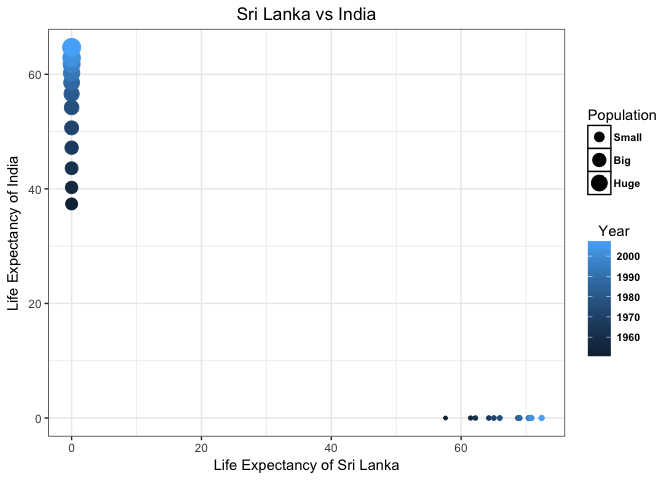

Hw04
================
Abdullah Farouk
2017-10-08

In this homework assignment I try out the following tasks outlined for us in the hw04 webpage. I primarily use the Gapminder dataset along with a new dataset I found called country codes. It contains the ISO codes and the continental region for the different countries in the gapminder dataset. I run into interesting problems when I try to join the two dataframes and this leads to me exploring alternative join functions to overcome them.

``` r
suppressPackageStartupMessages(library(tidyverse))
suppressPackageStartupMessages(library(gapminder))
```

Make a tibble with one row per year and columns for life expectancy for two or more countries. Use knitr::kable() to make this table look pretty in your rendered homework.Take advantage of this new data shape to scatterplot life expectancy for one country against that of another.
----------------------------------------------------------------------------------------------------------------------------------------------------------------------------------------------------------------------------------------------------------------------------------------

For this activity I chose to analyze variations in life expectancy trends between Sri Lanka and India. I chose India as my comparative benchmark simply because it's Sri Lanka's closest neighbor. The question I want an answer to is "Does Sri Lanka have a better healthcare system than India?" If this is the case, since Sri Lanka has a smaller population it may be able to allocate a greater proportion of it's gdp towards the provision of good healthcare to it's people. This should translate to higher life expectancies of it's people. Is there evidence in the data to support such a claim?

In order to answer my question, I first create a filtered table of the gapminder dataset. I had difficulty deciding between which of the data reshaping functions (spread or gather) to use as I could not understand what each function was supposed to do. I managed to learn how to use gather and spread functions [through this website](http://garrettgman.github.io/tidying/)

Since the question asked for a column for the life expectancy of each country, I used the spread function to 'spread' the values of life expectancy into the different country columns that my function call created.

Once I produced my table , I proceeded to try and graph my results. Lets analyze what I got.

``` r
#Was trying to use gather incorrectly. Now trying spread!
gapminder_wide_form <- gapminder %>% 
  filter(country == 'Sri Lanka' | country == 'India') %>%  # , 'Pakistan', 'Bangladesh'
  select(year, country ,lifeExp, pop) %>% 
  spread(key = country, value = lifeExp, fill = 0) 
gapminder_wide_form
```

    ## # A tibble: 24 × 4
    ##     year       pop  India `Sri Lanka`
    ## *  <int>     <int>  <dbl>       <dbl>
    ## 1   1952   7982342  0.000      57.593
    ## 2   1952 372000000 37.373       0.000
    ## 3   1957   9128546  0.000      61.456
    ## 4   1957 409000000 40.249       0.000
    ## 5   1962  10421936  0.000      62.192
    ## 6   1962 454000000 43.605       0.000
    ## 7   1967  11737396  0.000      64.266
    ## 8   1967 506000000 47.193       0.000
    ## 9   1972  13016733  0.000      65.042
    ## 10  1972 567000000 50.651       0.000
    ## # ... with 14 more rows

``` r
knitr::kable(gapminder_wide_form)
```

|  year|         pop|   India|  Sri Lanka|
|-----:|-----------:|-------:|----------:|
|  1952|     7982342|   0.000|     57.593|
|  1952|   372000000|  37.373|      0.000|
|  1957|     9128546|   0.000|     61.456|
|  1957|   409000000|  40.249|      0.000|
|  1962|    10421936|   0.000|     62.192|
|  1962|   454000000|  43.605|      0.000|
|  1967|    11737396|   0.000|     64.266|
|  1967|   506000000|  47.193|      0.000|
|  1972|    13016733|   0.000|     65.042|
|  1972|   567000000|  50.651|      0.000|
|  1977|    14116836|   0.000|     65.949|
|  1977|   634000000|  54.208|      0.000|
|  1982|    15410151|   0.000|     68.757|
|  1982|   708000000|  56.596|      0.000|
|  1987|    16495304|   0.000|     69.011|
|  1987|   788000000|  58.553|      0.000|
|  1992|    17587060|   0.000|     70.379|
|  1992|   872000000|  60.223|      0.000|
|  1997|    18698655|   0.000|     70.457|
|  1997|   959000000|  61.765|      0.000|
|  2002|    19576783|   0.000|     70.815|
|  2002|  1034172547|  62.879|      0.000|
|  2007|    20378239|   0.000|     72.396|
|  2007|  1110396331|  64.698|      0.000|

``` r
#Plot of life expectancy of Sri Lanka against India
gapminder_wide_form %>% 
  ggplot(aes(x = `Sri Lanka`, y = India)) +
  geom_point(aes(size = pop/10^9, color = year) ,show.legend = TRUE) +  # Divide pop by billion to get more readable output.
  theme_bw() +
  labs(title = 'Sri Lanka vs India' , x = 'Life Expectancy of Sri Lanka', y = 'Life Expectancy of India', colour = "Year", size = "Population") +
  theme(legend.justification = 'center', legend.position = "right", legend.title.align = 0.5, plot.title = element_text(hjust = 0.5)) +
  theme(legend.key = element_rect(fill = "white", colour = "black")) +
  theme(legend.text = element_text(size = 8, colour = "black", face = 'bold')) +
  scale_size_continuous(breaks=c(0.2, 0.5, 0.8),
                             labels=c("Small", "Big", "Huge"))
```



``` r
#Finally!
```

The bubbles get lighter as we move forward in time and its size varies based on how big the population was at that point in time. I used a nifty trick seen in [class 08 notes](https://stat545.com/cm008-notes_and_exercises.html) to convert my population legend into a more readable form.

We notice that both countries have experienced an increase in life expectancy over time. However there are some stark differences that this graph makes clear. For starters we see that Sri Lanka started off with a much higher value and has maintained a much higher life expectancy than India.

Does this mean Sri Lanka has a better healthcare system? Not neccessairly. It's easy to see that India has managed to double it's life expectancy over the span of 50 years, whilst its population has grown almost three fold during that span of time. This is quite an incredible feet! Hence like most things in life, the answer to my inital question is not as straightforward as we would like it to be.

Create a second data frame, complementary to Gapminder. Join this with (part of) Gapminder using a dplyr join function and make some observations about the process and result. Explore the different types of joins. Examples of a second data frame you could build: One row per country, a country variable and one or more variables with extra info, such as language spoken, NATO membership, national animal, or capitol city. If you really want to be helpful, you could attempt to make a pull request to resolve this issue, where I would like to bring ISO country codes into the gapminder package. One row per continent, a continent variable and one or more variables with extra info, such as northern versus southern hemisphere.
-----------------------------------------------------------------------------------------------------------------------------------------------------------------------------------------------------------------------------------------------------------------------------------------------------------------------------------------------------------------------------------------------------------------------------------------------------------------------------------------------------------------------------------------------------------------------------------------------------------------------------------------------------------------------------------------------------------------------------------------------------

In this activity I try to bring in the ISO codes and the continental regions for each country in our gapminder dataset. I use the [countrycode dataset in r](https://cran.r-project.org/web/packages/countrycode/countrycode.pdf) and create a dataframe, called country\_codes, with the variables I would like to keep from it.

``` r
# Please use install.packages("countrycode")
library(countrycode)
knitr::kable(head(countrycode_data))
```

| ar5      | continent | cowc |  cown| eu28 | eurocontrol\_pru | eurocontrol\_statfor |  fao| fips105 | icao | icao\_region |  imf| ioc | iso2c | iso3c |  iso3n| region          |   un| wb  | country.name.ar | country.name.de    | country.name.de.regex | country.name.en | country.name.en.regex | country.name.es | country.name.fr | country.name.ru | country.name.zh | eurostat | wb\_api2c | wb\_api3c | p4\_scode |  p4\_ccode|  wvs|
|:---------|:----------|:-----|-----:|:-----|:-----------------|:---------------------|----:|:--------|:-----|:-------------|----:|:----|:------|:------|------:|:----------------|----:|:----|:----------------|:-------------------|:----------------------|:----------------|:----------------------|:----------------|:----------------|:----------------|:----------------|:---------|:----------|:----------|:----------|----------:|----:|
| ASIA     | Asia      | AFG  |   700| NA   | Asia             | Asia/Pacific         |    2| AF      | OA   | O            |  512| AFG | AF    | AFG   |      4| Southern Asia   |    4| AFG | أفغانستان       | Afghanistan        | afghan                | Afghanistan     | afghan                | Afganistán      | Afghanistan     | Афганистан      | 阿富汗          | AF       | AF        | AFG       | AFG       |        700|    4|
| OECD1990 | Europe    | NA   |    NA| NA   | Eurocontrol      | ESRA North-West      |   NA| NA      | EF   | E            |   NA| NA  | AX    | ALA   |    248| Northern Europe |  248| ALA | NA              | Aland Islands      |                       | Aland Islands   |                       | NA              | NA              | NA              | NA              | NA       | NA        | NA        | NA        |         NA|   NA|
| EIT      | Europe    | ALB  |   339| NA   | Eurocontrol      | ESRA East            |    3| AL      | LA   | L            |  914| ALB | AL    | ALB   |      8| Southern Europe |    8| ALB | ألبانيا         | Albanien           | albanien              | Albania         | albania               | Albania         | Albanie         | Албания         | 阿尔巴尼亚      | AL       | AL        | ALB       | ALB       |        339|    8|
| MAF      | Africa    | ALG  |   615| NA   | Africa           | North-Africa         |    4| AG      | DA   | D            |  612| ALG | DZ    | DZA   |     12| Northern Africa |   12| DZA | الجزائر         | Algerien           | algerien              | Algeria         | algeria               | Argelia         | Algérie         | Алжир           | 阿尔及利亚      | DZ       | DZ        | DZA       | ALG       |        615|   12|
| ASIA     | Oceania   | NA   |    NA| NA   | Asia             | Asia/Pacific         |   NA| AQ      | NS   | N            |  859| ASA | AS    | ASM   |     16| Polynesia       |   16| ASM | NA              | Amerikanisch-Samoa | ^(?=.*amerik).*samoa  | American Samoa  | ^(?=.*americ).*samoa  | NA              | NA              | NA              | NA              | AS       | AS        | ASM       | NA        |         NA|   16|
| OECD1990 | Europe    | AND  |   232| NA   | NA               | NA                   |    6| AN      | NA   | NA           |   NA| AND | AD    | AND   |     20| Southern Europe |   20| ADO | أندورا          | Andorra            | andorra               | Andorra         | andorra               | Andorra         | Andorre         | Андорра         | 安道尔          | AD       | AD        | AND       | NA        |         NA|   20|

``` r
#Create country dataframe with select variables of interest
country_codes <- countrycode_data %>% 
  select(continent, country.name.en , iso2c, iso3c, region) %>% 
  rename(country = country.name.en) # Makes it easier to use inner_join function
knitr::kable(head(country_codes))
```

| continent | country        | iso2c | iso3c | region          |
|:----------|:---------------|:------|:------|:----------------|
| Asia      | Afghanistan    | AF    | AFG   | Southern Asia   |
| Europe    | Aland Islands  | AX    | ALA   | Northern Europe |
| Europe    | Albania        | AL    | ALB   | Southern Europe |
| Africa    | Algeria        | DZ    | DZA   | Northern Africa |
| Oceania   | American Samoa | AS    | ASM   | Polynesia       |
| Europe    | Andorra        | AD    | AND   | Southern Europe |

To begin my join operations, I look for which countries in the gapminder dataset I have ISO codes for in my countrycodes dataset. To do so I perform the following:

``` r
#Are all the countries in the gapminder dataset found in the country code dataset?
verify_countries <- semi_join(x = gapminder, y = country_codes)
```

    ## Joining, by = c("country", "continent")

``` r
knitr::kable(head(verify_countries))
```

| country     | continent |  year|  lifeExp|       pop|  gdpPercap|
|:------------|:----------|-----:|--------:|---------:|----------:|
| Afghanistan | Asia      |  1952|   28.801|   8425333|   779.4453|
| Afghanistan | Asia      |  1957|   30.332|   9240934|   820.8530|
| Afghanistan | Asia      |  1962|   31.997|  10267083|   853.1007|
| Afghanistan | Asia      |  1967|   34.020|  11537966|   836.1971|
| Afghanistan | Asia      |  1972|   36.088|  13079460|   739.9811|
| Afghanistan | Asia      |  1977|   38.438|  14880372|   786.1134|

``` r
n_distinct(verify_countries$country) == n_distinct(gapminder$country) # Answer is FALSE
```

    ## [1] FALSE

I notice that I don't have ISO codes for all the countries. Hence I look for whcich countries I dont have codes for.

``` r
#Which countries do I not have ISO codes for?
missing_countries <- anti_join(x = gapminder, y = country_codes)
```

    ## Joining, by = c("country", "continent")

``` r
knitr::kable(head(missing_countries))
```

| country     | continent |  year|  lifeExp|      pop|  gdpPercap|
|:------------|:----------|-----:|--------:|--------:|----------:|
| Yemen, Rep. | Asia      |  1952|   32.548|  4963829|   781.7176|
| Yemen, Rep. | Asia      |  1957|   33.970|  5498090|   804.8305|
| Yemen, Rep. | Asia      |  1962|   35.180|  6120081|   825.6232|
| Yemen, Rep. | Asia      |  1967|   36.984|  6740785|   862.4421|
| Yemen, Rep. | Asia      |  1972|   39.848|  7407075|  1265.0470|
| Yemen, Rep. | Asia      |  1977|   44.175|  8403990|  1829.7652|

``` r
n_distinct(missing_countries$country) 
```

    ## [1] 21

This is why my inner\_join will not give me the ISO codes for all the countries in the gapminder dataset. It turns out the countries I am missing codes for have different naming conventions in both the data sets.

Note: I renamed my country column in the country\_codes data frame to make it easier for the inner\_join function to operate on my dataframes. I used this website to [learn how to rename columns in a datset](https://blog.exploratory.io/selecting-columns-809bdd1ef615)

``` r
#Here I add the ISO codes to each country in the gapminder dataset.
gapminder_update <- inner_join(gapminder, country_codes)
```

    ## Joining, by = c("country", "continent")

    ## Warning in inner_join_impl(x, y, by$x, by$y, suffix$x, suffix$y): joining
    ## factor and character vector, coercing into character vector

    ## Warning in inner_join_impl(x, y, by$x, by$y, suffix$x, suffix$y): joining
    ## factor and character vector, coercing into character vector

``` r
gapminder_iso <- gapminder_update %>% 
  select(country, continent, pop, iso3c, region)
knitr::kable(head(gapminder_iso))
```

| country     | continent |       pop| iso3c | region        |
|:------------|:----------|---------:|:------|:--------------|
| Afghanistan | Asia      |   8425333| AFG   | Southern Asia |
| Afghanistan | Asia      |   9240934| AFG   | Southern Asia |
| Afghanistan | Asia      |  10267083| AFG   | Southern Asia |
| Afghanistan | Asia      |  11537966| AFG   | Southern Asia |
| Afghanistan | Asia      |  13079460| AFG   | Southern Asia |
| Afghanistan | Asia      |  14880372| AFG   | Southern Asia |

``` r
n_distinct(gapminder_iso$country) == n_distinct(gapminder$country) #Answer is FALSE
```

    ## [1] FALSE

A quick and easy fix is to use the full\_join command. This allows me to associate an ISO code with every country in the Gapminder dataset. This is a quick fix because I avoide having to change the names of the 21 countries in the gapminder dataset that have a different naming convention in my country codes database.

However doing so would be a more appropriate task, which I do not know how to perform unfortunately.

``` r
#Include ISO codes of countries left out due to naming convention differences.
gapminder_iso_full <- full_join(gapminder, country_codes)
```

    ## Joining, by = c("country", "continent")

    ## Warning in full_join_impl(x, y, by$x, by$y, suffix$x, suffix$y): joining
    ## character vector and factor, coercing into character vector

    ## Warning in full_join_impl(x, y, by$x, by$y, suffix$x, suffix$y): joining
    ## character vector and factor, coercing into character vector

``` r
n_distinct(gapminder_iso_full$country)
```

    ## [1] 293

``` r
knitr::kable(head(gapminder_iso_full))
```

| country     | continent |  year|  lifeExp|       pop|  gdpPercap| iso2c | iso3c | region        |
|:------------|:----------|-----:|--------:|---------:|----------:|:------|:------|:--------------|
| Afghanistan | Asia      |  1952|   28.801|   8425333|   779.4453| AF    | AFG   | Southern Asia |
| Afghanistan | Asia      |  1957|   30.332|   9240934|   820.8530| AF    | AFG   | Southern Asia |
| Afghanistan | Asia      |  1962|   31.997|  10267083|   853.1007| AF    | AFG   | Southern Asia |
| Afghanistan | Asia      |  1967|   34.020|  11537966|   836.1971| AF    | AFG   | Southern Asia |
| Afghanistan | Asia      |  1972|   36.088|  13079460|   739.9811| AF    | AFG   | Southern Asia |
| Afghanistan | Asia      |  1977|   38.438|  14880372|   786.1134| AF    | AFG   | Southern Asia |

Explore the base function merge(), which also does joins. Compare and contrast with dplyr joins.
------------------------------------------------------------------------------------------------

``` r
# Call on the merge function
gapminder_country_code_merge <- merge(x = gapminder, y = country_codes)
knitr::kable(head(gapminder_country_code_merge))
```

| country     | continent |  year|  lifeExp|       pop|  gdpPercap| iso2c | iso3c | region        |
|:------------|:----------|-----:|--------:|---------:|----------:|:------|:------|:--------------|
| Afghanistan | Asia      |  1967|   34.020|  11537966|   836.1971| AF    | AFG   | Southern Asia |
| Afghanistan | Asia      |  2002|   42.129|  25268405|   726.7341| AF    | AFG   | Southern Asia |
| Afghanistan | Asia      |  1957|   30.332|   9240934|   820.8530| AF    | AFG   | Southern Asia |
| Afghanistan | Asia      |  1997|   41.763|  22227415|   635.3414| AF    | AFG   | Southern Asia |
| Afghanistan | Asia      |  1987|   40.822|  13867957|   852.3959| AF    | AFG   | Southern Asia |
| Afghanistan | Asia      |  1952|   28.801|   8425333|   779.4453| AF    | AFG   | Southern Asia |

``` r
n_distinct(gapminder_country_code_merge$country) # How many countries match
```

    ## [1] 121

``` r
# Now i call on the match function
gapminder_country_code_match <- match(x = gapminder$country, table = country_codes$country, nomatch = 0) # the no match arguement tells R to replace NA's with 0's if there is no match.
n_distinct(gapminder_country_code_match) # How many countries match
```

    ## [1] 123

``` r
which(gapminder_country_code_match == 0) # Are there any that don't?
```

    ##   [1]  133  134  135  136  137  138  139  140  141  142  143  144  325  326
    ##  [15]  327  328  329  330  331  332  333  334  335  336  337  338  339  340
    ##  [29]  341  342  343  344  345  346  347  348  361  362  363  364  365  366
    ##  [43]  367  368  369  370  371  372  553  554  555  556  557  558  559  560
    ##  [57]  561  562  563  564  625  626  627  628  629  630  631  632  633  634
    ##  [71]  635  636  661  662  663  664  665  666  667  668  669  670  671  672
    ##  [85]  721  722  723  724  725  726  727  728  729  730  731  732  829  830
    ##  [99]  831  832  833  834  835  836  837  838  839  840  841  842  843  844
    ## [113]  845  846  847  848  849  850  851  852 1369 1370 1371 1372 1373 1374
    ## [127] 1375 1376 1377 1378 1379 1380 1489 1490 1491 1492 1493 1494 1495 1496
    ## [141] 1497 1498 1499 1500 1501 1502 1503 1504 1505 1506 1507 1508 1509 1510
    ## [155] 1511 1512 1513 1514 1515 1516 1517 1518 1519 1520 1521 1522 1523 1524
    ## [169] 1597 1598 1599 1600 1601 1602 1603 1604 1605 1606 1607 1608 1609 1610
    ## [183] 1611 1612 1613 1614 1615 1616 1617 1618 1619 1620 1633 1634 1635 1636
    ## [197] 1637 1638 1639 1640 1641 1642 1643 1644 1645 1646 1647 1648 1649 1650
    ## [211] 1651 1652 1653 1654 1655 1656 1657 1658 1659 1660 1661 1662 1663 1664
    ## [225] 1665 1666 1667 1668 1669 1670 1671 1672 1673 1674 1675 1676 1677 1678
    ## [239] 1679 1680

The merge function is identical in it's functionality to the inner\_join command in dplyr, merging rows by countries with the same naming convention in both dataframes. The match function on the other hand differs. It does not give the rows or a data frame with matching entries but rather the position of entries in the fisrt vector, in the second vector.

To verify if my merge function operates like an inner join I use the n\_distinct function. It matches the results I get when I perform my inner join call as well. I do the same on my match call and I notice I get 2 more matches relative to my merge and inner join function call. I am unsure how to interpret this result. On a final note I also check to see if there are entries that dont match, which there seem to be.

This assignment helped me learn how to convert my data into different shapes and how these shapes allow me to accomplish tasks of varying complexity. I really enjoyed this and merging datasets so that I have more variables to play with to enrich my analysis and exploration.
