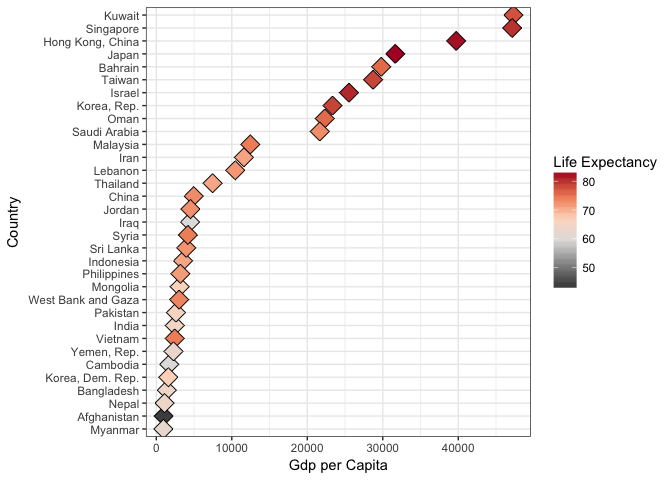
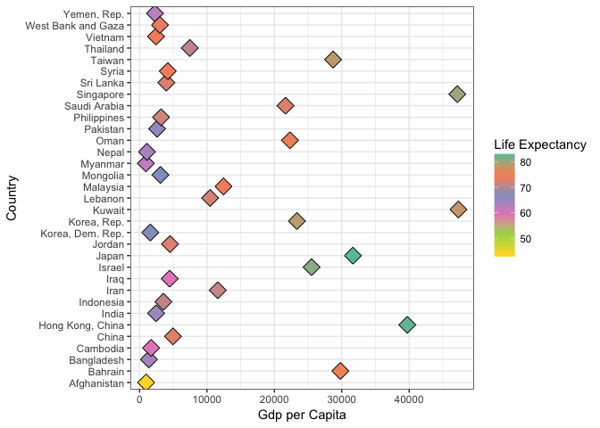
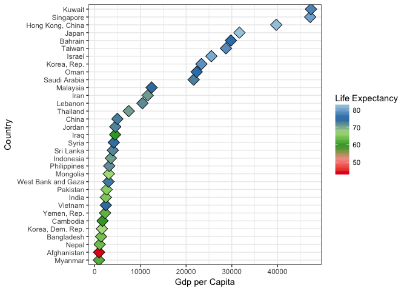

Hw05
================
Abdullah Farouk
2017-10-16

In this assignment, I attempt the tasks asked of us in [hw05](http://stat545.com/hw05_factor-figure-boss-repo-hygiene.html).

``` r
suppressPackageStartupMessages(library(tidyverse))
suppressPackageStartupMessages(library(forcats))
suppressPackageStartupMessages(library(gapminder))
suppressPackageStartupMessages(library(RColorBrewer))
suppressPackageStartupMessages(library(dplyr))
suppressPackageStartupMessages(library(knitr))
```

Drop Oceania. Filter the Gapminder data to remove observations associated with the continent of Oceania. Additionally, remove unused factor levels. Provide concrete information on the data before and after removing these rows and Oceania; address the number of rows and the levels of the affected factors.
-----------------------------------------------------------------------------------------------------------------------------------------------------------------------------------------------------------------------------------------------------------------------------------------------------------------

``` r
#Gapminder after dropping Oceania
continent_new <- c("Africa" , "Americas" , "Asia", "Europe")
gap_less_oceania <- gapminder %>% 
  filter(continent %in% continent_new) %>% 
  droplevels() # fct_drop does not work for some reason!

#Continent specifications of Gapminder without Oceania
n_distinct(levels(gap_less_oceania$continent)) 
```

    ## [1] 4

``` r
nrow(gap_less_oceania)
```

    ## [1] 1680

``` r
#Continent specifications of Gapminder with Oceania
n_distinct(levels(gapminder$continent))
```

    ## [1] 5

``` r
nrow(gapminder)
```

    ## [1] 1704

Here we notice that we now have 4 continents and 1680 rows vs 5 continents and 1704 rows in the original dataset. Thus we have verification of the removal of Oceania from our dataset. We observe that the information related to countries in all the other continents are the same across datasets.

Over here and in the rest of the assignment I could not seem to drop levels using the fct\_drop function for some reason.

Reorder the levels of country or continent. Use the forcats package to change the order of the factor levels, based on a principled summary of one of the quantitative variables. Consider experimenting with a summary statistic beyond the most basic choice of the median.
-----------------------------------------------------------------------------------------------------------------------------------------------------------------------------------------------------------------------------------------------------------------------------

``` r
#Basic reordering
levels(gap_less_oceania$continent)
```

    ## [1] "Africa"   "Americas" "Asia"     "Europe"

``` r
continent_count <- gap_less_oceania$continent %>% 
  fct_count()     # Check how many countries each continent has
continent_count
```

    ## # A tibble: 4 × 2
    ##          f     n
    ##     <fctr> <int>
    ## 1   Africa   624
    ## 2 Americas   300
    ## 3     Asia   396
    ## 4   Europe   360

``` r
#Order by frequency
continent_by_frequency <- gap_less_oceania$continent %>% 
  fct_infreq() %>% 
  levels() %>% 
  head()
continent_by_frequency
```

    ## [1] "Africa"   "Asia"     "Europe"   "Americas"

``` r
#Reordering by a different variable. I consider setting levels according to how dispersed life expectancy is across each country. I then sort it from highest to lowest.
fct_reorder(f = gap_less_oceania$country , x = gap_less_oceania$lifeExp, fun = IQR, .desc = TRUE) %>% 
  levels() %>% 
  head()
```

    ## [1] "Oman"               "Vietnam"            "Saudi Arabia"      
    ## [4] "Libya"              "Yemen, Rep."        "West Bank and Gaza"

I first have a look at the order of the levels of the continent variable in my dataset. I then attempt to reorder continent by the in descending order of the number of countries in them. To do so I called on the count function in forcats to calculate the number of countries in each continent. I then used the fct\_infreq() function to reorder the levels of my continent variable.

For the next part I reorder the levels of "country" in my dataset by the Inter Quartile Range of 'Life Expectancy' in each of them. I then sort the levels from highest to lowest. Hence the first level of 'country' corresponds to the country with the highest IQR of life expectancy and the last, the lowest respectively.

I used the following link to learn more about [factors](http://r4ds.had.co.nz/factors.html)

Explore the effects of arrange(). Does merely arranging the data have any effect on, say, a figure?
---------------------------------------------------------------------------------------------------

``` r
#Exploring the effects or arrange
xplr_without_arrng <- gapminder %>% 
  filter(year == 2007, continent == "Asia") %>% 
  ggplot(aes(x = gdpPercap, y = fct_reorder(country, gdpPercap))) +
  geom_point(aes(fill=lifeExp), pch = 23, size = 5) +
  scale_fill_distiller(palette="RdGy") +
  theme_bw() +
  labs(x = 'Gdp per Capita', y = 'Country', fill = 'Life Expectancy')
xplr_without_arrng
```



``` r
#Arrange data by gdpPercap
xplr_arrng <- gapminder %>% 
  filter(year == 2007, continent == "Asia") %>% 
  arrange(gdpPercap) 

#Figure with arrange
fig_without_fctr <- xplr_arrng %>% 
  ggplot(aes(x = gdpPercap, y = country)) +
  geom_point(aes(fill=lifeExp), pch = 23, size = 5) +
  scale_fill_distiller(palette="Set2") +
  theme_bw() +
  labs(x = 'Gdp per Capita', y = 'Country', fill = 'Life Expectancy')
fig_without_fctr
```



``` r
# Now lets plot the data reordering our country variable by gdpPercap
fig_with_fctr <- xplr_arrng %>% 
  ggplot(aes(x = gdpPercap, y = fct_reorder(country, gdpPercap))) +
  geom_point(aes(fill=lifeExp), pch = 23, size = 5) +
  scale_fill_distiller(palette="Paired") +
  theme_bw() +
  labs(x = 'Gdp per Capita', y = 'Country', fill = 'Life Expectancy')
fig_with_fctr
```



We notice that reordering the levels of "country" by the quantitative variabel "gdpPercap" results in an easy to interpret graph. The colour of each diamond represents the life expectancy of each country. This makes it very easy to see that countries with high gdp per capita tend to also have higher life expectancies.

Notice however this trend is difficult to observe from the next figure which only arranges the data by country but does not reorder the levels of the variable "country". The third diagram illustrates no observable difference from arranging our data when we reorder our qualtiative factor variable "country".

The three diagrams tell us an interesting story. The first shows that reordering "country" by the quantitative factor we are plotting it against will reveal any trends in the data. This also holds true when we reorder it after arranging our data. This leads me to believe that arranging, while helps us spot trends in tables, has almost no effect when it comes to graphing them. This is verified by the second plot which, despite having the data arranged by gdp per capita, plots points according to the order of "levels" of country!

Use ggsave() to explicitly save a plot to file.
-----------------------------------------------

``` r
?ggsave #Find out what arguements it takes
ggsave(filename = 'without_arrange.png', plot = fig_without_fctr, device = 'png', width = 6, height = 6)

#try plotting device like pdf
pdf("Countries_ordered_by_gdpPercap.pdf", width=12, height=6)
fig_with_fctr
dev.off()
```

    ## quartz_off_screen 
    ##                 2

I chose to save my plot as a png file. In addition in this part of the assignment I chose to explore the capabilites of the graphic device pdf. As requested please find a link to my  plot here.

Experiment with one or more of write\_csv()/read\_csv() (and/or TSV friends), saveRDS()/readRDS(), dput()/dget(). Create something new, probably by filtering or grouped-summarization of Singer or Gapminder. I highly recommend you fiddle with the factor levels, i.e. make them non-alphabetical (see previous section). Explore whether this survives the round trip of writing to file then reading back in.
------------------------------------------------------------------------------------------------------------------------------------------------------------------------------------------------------------------------------------------------------------------------------------------------------------------------------------------------------------------------------------------------------------------

``` r
#Wrtie to csv format
new_millenium <- gapminder %>% 
  filter(year >= 2000)
write_csv(new_millenium, "new_millenium.csv")

#Try reading what I just created
new_millenium_csv <- read_csv("/Users/abdullah/Desktop/Stat 545/STAT545-hw01-Farouk-Abdullah/STAT545-hw01-Farouk-Abdullah/Hw05/new_millenium.csv")
```

    ## Parsed with column specification:
    ## cols(
    ##   country = col_character(),
    ##   continent = col_character(),
    ##   year = col_integer(),
    ##   lifeExp = col_double(),
    ##   pop = col_integer(),
    ##   gdpPercap = col_double()
    ## )

``` r
kable(head(new_millenium_csv))
```

| country     | continent |  year|  lifeExp|       pop|  gdpPercap|
|:------------|:----------|-----:|--------:|---------:|----------:|
| Afghanistan | Asia      |  2002|   42.129|  25268405|   726.7341|
| Afghanistan | Asia      |  2007|   43.828|  31889923|   974.5803|
| Albania     | Europe    |  2002|   75.651|   3508512|  4604.2117|
| Albania     | Europe    |  2007|   76.423|   3600523|  5937.0295|
| Algeria     | Africa    |  2002|   70.994|  31287142|  5288.0404|
| Algeria     | Africa    |  2007|   72.301|  33333216|  6223.3675|

``` r
#Now lets play with factor reordering!
new_millenium_reodered <- new_millenium_csv %>% 
  mutate(country = fct_reorder(country, lifeExp, .desc = TRUE))

kable(head(levels(new_millenium_reodered$country)))
```

    ## Warning in kable_markdown(x = structure(c("Japan", "Hong Kong, China",
    ## "Switzerland", : The table should have a header (column names)

|                  |
|:-----------------|
| Japan            |
| Hong Kong, China |
| Switzerland      |
| Iceland          |
| Australia        |
| Sweden           |

``` r
#Retain factor order
saveRDS(new_millenium_reodered, "new_millenium_reodered.rds")
new_millenium_reodered <- readRDS("new_millenium_reodered.rds")
kable(head(levels(new_millenium_reodered$country))) #Levels are retained!
```

    ## Warning in kable_markdown(x = structure(c("Japan", "Hong Kong, China",
    ## "Switzerland", : The table should have a header (column names)

|                  |
|:-----------------|
| Japan            |
| Hong Kong, China |
| Switzerland      |
| Iceland          |
| Australia        |
| Sweden           |

This was a really fun exercise for me. I have always seen cool datasets I wanted to play with but could never get my hands on because I didnt know how to read them into R. Over here I create a new csv file by selecting observations from gapminder after the year 2000. I then read it in and change the order of the factor variable country in it. Its now ordered by median life expectancy of each of the countries, in descending fashion.

In order to retain the levels I use the RDS function. I then verify if the levels are retained. It looks they are.

Pick a handful of countries, each of which you can associate with a stereotypical food (or any other non-controversial thing … sport? hobby? type of music, art or dance? animal? landscape feature?). Create an excerpt of the Gapminder data, filtered to just these countries. Create a new factor – you pick the name! – by mapping the existing country factor levels to the new levels. Examples: Italy –&gt; wine, Germany –&gt; beer, Japan –&gt; sake. (Austria, Germany) –&gt; German, (Mexico, Spain) –&gt; Spanish, (Portugal, Brazil) –&gt; Portuguese. Let your creativity flourish
-------------------------------------------------------------------------------------------------------------------------------------------------------------------------------------------------------------------------------------------------------------------------------------------------------------------------------------------------------------------------------------------------------------------------------------------------------------------------------------------------------------------------------------------------------------------------------------------------

``` r
national_sport_csv <- read_csv("/Users/abdullah/Desktop/Stat 545/STAT545-hw01-Farouk-Abdullah/STAT545-hw01-Farouk-Abdullah/Hw05/Hw05_files/list-national-sports-749j.csv") %>% 
  rename(country = Country, sport = Sport) %>%  #Rename columns
  mutate(country = as_factor(country), sport = as_factor(sport)) %>%  #Turn sport into a factor variable
  select(country, sport)
```

    ## Parsed with column specification:
    ## cols(
    ##   Country = col_character(),
    ##   Sport = col_character(),
    ##   Year = col_integer()
    ## )

``` r
kable(head(national_sport_csv))
```

| country    | sport         |
|:-----------|:--------------|
| Argentina  | Pato          |
| Bahamas    | Sloop sailing |
| Bangladesh | Kabaddi       |
| Brazil     | Capoeira      |
| Canada     | Ice hockey    |
| hile       | Chilean rodeo |

``` r
#Choose countries in the gapminder dataset that are in national_sport_csv
cn <- levels(national_sport_csv$country)

gap_filtered <- gapminder %>% 
  filter(year == 2007, country %in% national_sport_csv$country) %>% 
  mutate(country = fct_relevel(country, cn)) %>% 
  droplevels()
```

    ## Warning: Unknown levels in `f`: Bahamas, hile, Anguilla, Antigua and
    ## Barbuda, Barbados, Bermuda, Bhutan, England, Grenada, Guyana, Latvia,
    ## Lithuania, Papua New Guinea, Russia, Scotland, Turks and Caicos Islands,
    ## Wales

``` r
#Piecing it all together
dn <- levels(gap_filtered$country)
p2 <- national_sport_csv %>% 
  filter(country %in% dn) %>% 
  droplevels()

gap_filtered <- inner_join(gap_filtered, p2) %>% 
  select(country, continent, sport, lifeExp, pop, gdpPercap)
```

    ## Joining, by = "country"

``` r
head(gap_filtered) # Kable does not work on this data frame for some reason
```

    ## # A tibble: 6 × 6
    ##       country continent      sport lifeExp       pop  gdpPercap
    ##        <fctr>    <fctr>     <fctr>   <dbl>     <int>      <dbl>
    ## 1 Afghanistan      Asia   Buzkashi  43.828  31889923   974.5803
    ## 2   Argentina  Americas       Pato  75.320  40301927 12779.3796
    ## 3  Bangladesh      Asia    Kabaddi  64.062 150448339  1391.2538
    ## 4      Brazil  Americas   Capoeira  72.390 190010647  9065.8008
    ## 5      Canada  Americas Ice hockey  80.653  33390141 36319.2350
    ## 6    Colombia  Americas       Tejo  72.889  44227550  7006.5804

As someone who enjoys Cricket and Basketball (what an odd combination) I wanted to see what each of the different countries in our gapminder dataset enjoyed playing during their past time. Hence I sought out to associate each country in Gapminder with its national sport. To do so I obtained data on [the national sport of countries](http://www.downloadexcelfiles.com/wo_en/download-excel-file-list-national-sports#.WejsvEwZM_V) from here.

I had to clean this dataset as it had weird line spacings and multiple sports for only some countries. I did so using my text editor. Once I got it in a form I liked, I read it unsing the read\_csv function. I then extracted information on the levels of the variable country. I then used this information to choose only those countries from the gapminder dataset.

I notice that my sports dataset had 48 countries whilst the filtered gapminder dataset had only 31 countries. Hence to *"piece it all together"* I select only those countries in my sports dataset that are also in the filtered gapminder dataset as well. To finally associate each country in the gapminder dataset with its national sport, I use the inner join function.

Note: I try calling on the kable function to display my table in a nice manner but I can't get it to run for some reason.

This assignment helped me learn how to work with factors, produce visually pleasing graphics, read in data from files in my computer and has allowed me to perform some really neat tasks! I really enjoyed this and look forward to using these skills in the future!
