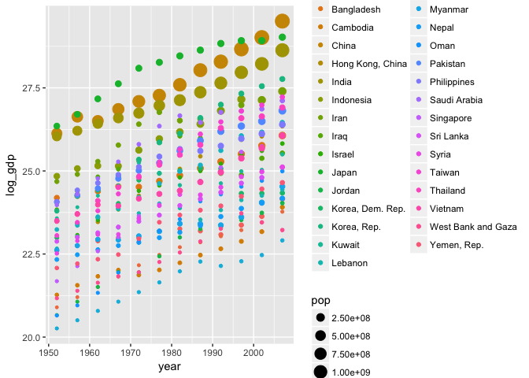
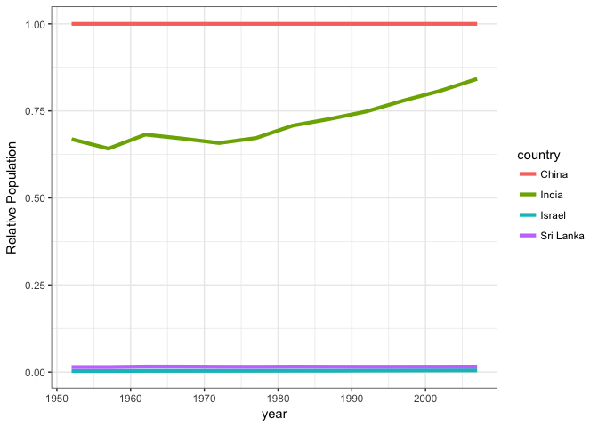

Exploring Gapminder Dataset
================
Abdullah Farouk
2017-09-22

I begin my analysis by installing the gapminder and tidyverse packages. This is followed by

``` r
library(gapminder)
library(tidyverse)
```

    ## Loading tidyverse: ggplot2
    ## Loading tidyverse: tibble
    ## Loading tidyverse: tidyr
    ## Loading tidyverse: readr
    ## Loading tidyverse: purrr
    ## Loading tidyverse: dplyr

    ## Conflicts with tidy packages ----------------------------------------------

    ## filter(): dplyr, stats
    ## lag():    dplyr, stats

Smell testing data
------------------

I can learn more about my variables using the following function call

``` r
sapply(gapminder, class)
```

    ##   country continent      year   lifeExp       pop gdpPercap 
    ##  "factor"  "factor" "integer" "numeric" "integer" "numeric"

``` r
glimpse(gapminder)
```

    ## Observations: 1,704
    ## Variables: 6
    ## $ country   <fctr> Afghanistan, Afghanistan, Afghanistan, Afghanistan,...
    ## $ continent <fctr> Asia, Asia, Asia, Asia, Asia, Asia, Asia, Asia, Asi...
    ## $ year      <int> 1952, 1957, 1962, 1967, 1972, 1977, 1982, 1987, 1992...
    ## $ lifeExp   <dbl> 28.801, 30.332, 31.997, 34.020, 36.088, 38.438, 39.8...
    ## $ pop       <int> 8425333, 9240934, 10267083, 11537966, 13079460, 1488...
    ## $ gdpPercap <dbl> 779.4453, 820.8530, 853.1007, 836.1971, 739.9811, 78...

The sappy function allows me to get the results back in a vector form.

Create temp variable to get data on Asian subcontinent

``` r
copy_1 <- gapminder

# I want to analyze Sri Lanka's data
temp <- copy_1 %>% 
  filter(continent == 'Asia')
```

``` r
#First I back out GDP

temp <- mutate(temp, log_gdp = log(gdpPercap*pop))
SL <- filter(temp, country == 'Sri Lanka')

#I want to visualize time trends within Sri Lanka

sl_lyfexp_trend <- ggplot(SL, aes(year, lifeExp))

#How does each variable evolve over time?

sl_lyfexp_trend + geom_bar( stat = "identity", aes(fill = year))
```


``` r
#People are living for longer. Has this had an effect on GDPor on population for that matter?
```

``` r
#I use a log scale to normalize for the differences in the magnitude of the numbers
sl_gdp_vs_pop <- ggplot(SL, aes(year)) + geom_line(aes(y = log_gdp, colour = 'gdp')) + geom_line(aes(y = log(pop), colour = 'pop')) + ylab('Values of gdp and Population')

sl_gdp_vs_pop
```


``` r
#We notice that GDP and population have both been growing. However gdp has been growing at a much faster rate.

#Is this something that is common trend among all Asian countries? To explore this idea I create a scatter plot of gdp of different countries across time. I vary the sizes of the dots by the population in each country to identify whether an inverse relationship exists

temp %>% 
  ggplot(aes(x= year, y = log_gdp)) + geom_point(aes(colour = country, size = pop))
```



``` r
#We notice that there are 3 Asian countries that have experienced tremendous GDP growth. They are China, Israel and India. What is interesting is that China and India have been able to do so despite having a very large population (size of a country's population can be inferred from the size of a point in the graphic). 

# Is there a possible link between life expectancy and gdp growth. Is it perhaps a country's ability to ensure it's population lives for longer that enables it to prosper economically?
```

``` r
#To answer this I subdivide my data further

top_3_asian_econ <- filter(temp, country %in% c("China", "India", 'Israel', 'Sri Lanka'))

asia_life_exp_bar_plot <- top_3_asian_econ %>% 
  ggplot(aes(x = country, y = lifeExp)) + geom_boxplot(fill = 'green', colour = 'black') + theme_bw() + ggtitle("Life Expectancy of Top 3 Asian Economies vs Sri Lanka")

asia_life_exp_bar_plot
```


``` r
# The distributions paints an interesting picture. Notice how the distribution of life expectancy in India and China are much wider than that of Sri lanka and Israel. Further they have a lower median value of life expectancy than Sri Lanka's and Israel's. 

#Perhaps their economic boom stems from the fact that their populations are young. 
```

``` r
#How does Sri Lanka compare to the top 3 in terms of gdp and population growth?  

rank <- top_3_asian_econ %>% 
  group_by(country) %>% 
  summarise_each(funs(mean), pop, lifeExp, log_gdp, gdpPercap)
       
rank
```

    ## # A tibble: 4 × 5
    ##     country       pop  lifeExp  log_gdp gdpPercap
    ##      <fctr>     <dbl>    <dbl>    <dbl>     <dbl>
    ## 1     China 958160052 61.78514 27.63289  1488.308
    ## 2     India 701130740 53.16608 27.16180  1057.296
    ## 3    Israel   3845611 73.64583 24.49465 14160.936
    ## 4 Sri Lanka  14545832 66.52608 23.87595  1854.731

``` r
# Since China has the largest average population and log gdp values. I normalize everyone else's values of population and log gdp using China's. The folllowing code is cited from stat 545 lecture on dplyr (http://stat545.com/block010_dplyr-end-single-table.html)
```

``` r
#First extract data on China
china <- top_3_asian_econ %>%
  filter(country == "China")

top_3_asian_econ <- mutate(top_3_asian_econ, tmp = rep(china$log_gdp, n_distinct(country)), log_gdp_rel = log_gdp / tmp, tmp = NULL, tmp_1 = rep(china$pop,n_distinct(country)), pop_rel = pop/tmp_1, tmp_1 = NULL)
         
#Now i plot the trends in population and gdp growth. The code was sourced from stackexchange. (https://stackoverflow.com/questions/29357612/plot-labels-at-ends-of-lines)
```

``` r
rel_gdp_performance <- ggplot(top_3_asian_econ) + 
  geom_line(aes(x = year, y = log_gdp_rel, group = country, colour = country), linetype = 2, size = 1.5) + ylab('Relative log GDP') + theme_bw()

rel_pop_performance <- ggplot(top_3_asian_econ) + 
  geom_line(aes(x = year, y = pop_rel, group = country, colour = country), size = 1.5) + ylab('Relative Population') + theme_bw()

rel_pop_performance
```



``` r
rel_gdp_performance
```


