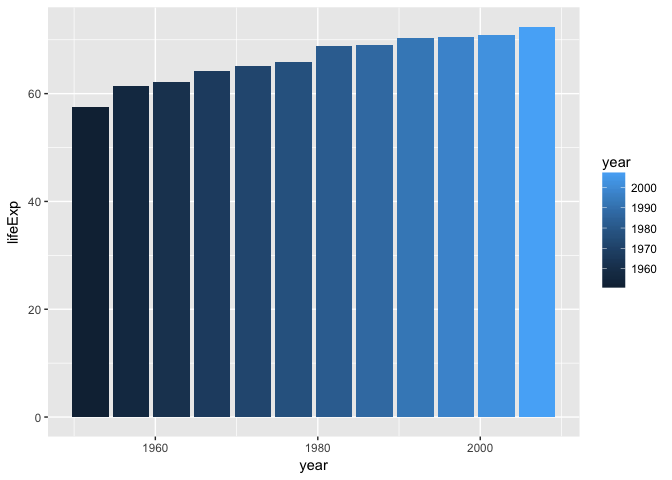
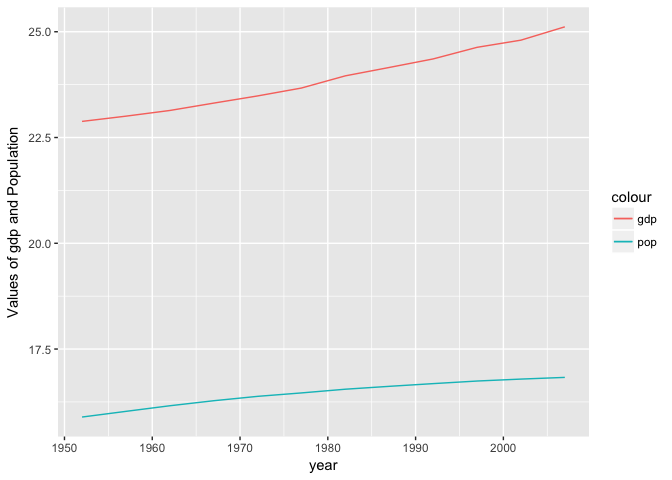
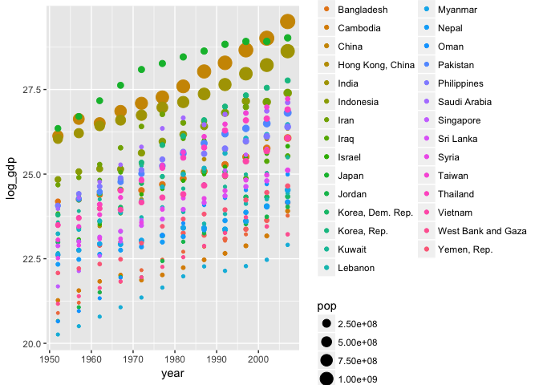
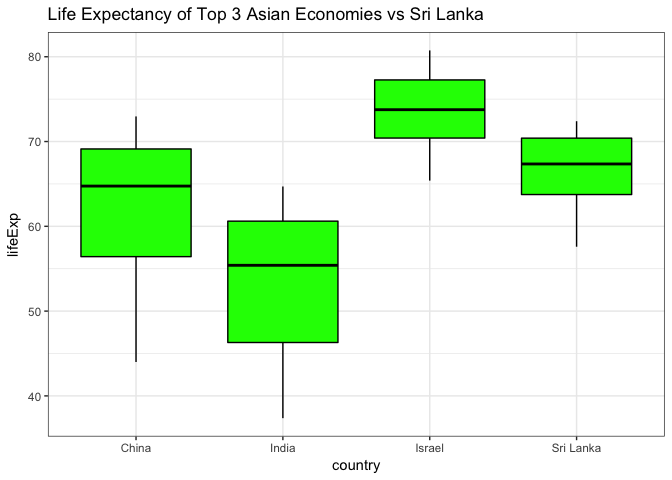
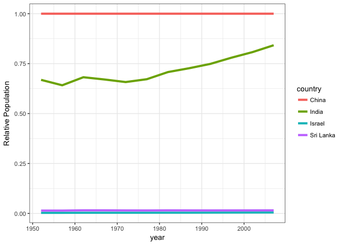
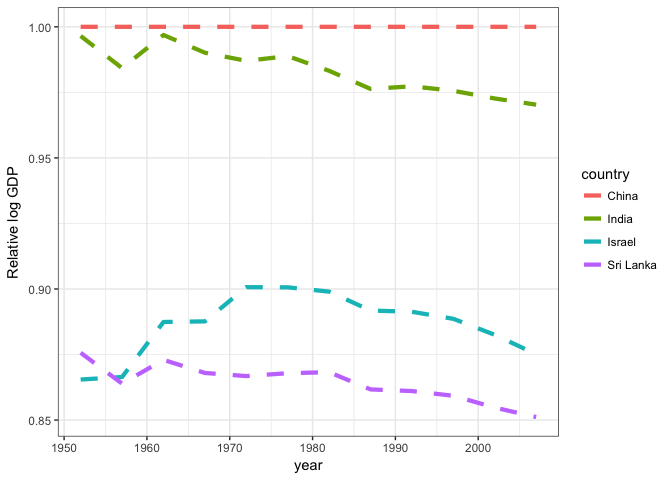

Exploring Gapminder Dataset
================
Abdullah Farouk
2017-09-22

I begin my analysis by installing the gapminder and tidyverse packages. This is followed by

``` r
library(gapminder)
library(tidyverse)
```

    ## Loading tidyverse: ggplot2
    ## Loading tidyverse: tibble
    ## Loading tidyverse: tidyr
    ## Loading tidyverse: readr
    ## Loading tidyverse: purrr
    ## Loading tidyverse: dplyr

    ## Conflicts with tidy packages ----------------------------------------------

    ## filter(): dplyr, stats
    ## lag():    dplyr, stats

Smell testing data
------------------

I can learn more about my dataset and the variables in it using the following function call

``` r
#What type of object does our dataset resemble?
head(gapminder)
```

    ## # A tibble: 6 × 6
    ##       country continent  year lifeExp      pop gdpPercap
    ##        <fctr>    <fctr> <int>   <dbl>    <int>     <dbl>
    ## 1 Afghanistan      Asia  1952  28.801  8425333  779.4453
    ## 2 Afghanistan      Asia  1957  30.332  9240934  820.8530
    ## 3 Afghanistan      Asia  1962  31.997 10267083  853.1007
    ## 4 Afghanistan      Asia  1967  34.020 11537966  836.1971
    ## 5 Afghanistan      Asia  1972  36.088 13079460  739.9811
    ## 6 Afghanistan      Asia  1977  38.438 14880372  786.1134

``` r
#Since our dataset has variables of different data types in one column, it must be a data frame. This can be verified by the following code

is.data.frame(gapminder)
```

    ## [1] TRUE

``` r
#type of object our dataset is stored as
class(gapminder)
```

    ## [1] "tbl_df"     "tbl"        "data.frame"

``` r
#Dimensions of our dataset
dim(gapminder)
```

    ## [1] 1704    6

``` r
#data type of each variable. The sapply function allows me to get the results of my function call back in a vector form.
sapply(gapminder, class)
```

    ##   country continent      year   lifeExp       pop gdpPercap 
    ##  "factor"  "factor" "integer" "numeric" "integer" "numeric"

``` r
#or alternatively one could try
sapply(gapminder, typeof)
```

    ##   country continent      year   lifeExp       pop gdpPercap 
    ## "integer" "integer" "integer"  "double" "integer"  "double"

``` r
#Alternate way of learning about the dataset
sapply(gapminder, str)
```

    ##  Factor w/ 142 levels "Afghanistan",..: 1 1 1 1 1 1 1 1 1 1 ...
    ##  Factor w/ 5 levels "Africa","Americas",..: 3 3 3 3 3 3 3 3 3 3 ...
    ##  int [1:1704] 1952 1957 1962 1967 1972 1977 1982 1987 1992 1997 ...
    ##  num [1:1704] 28.8 30.3 32 34 36.1 ...
    ##  int [1:1704] 8425333 9240934 10267083 11537966 13079460 14880372 12881816 13867957 16317921 22227415 ...
    ##  num [1:1704] 779 821 853 836 740 ...

    ## $country
    ## NULL
    ## 
    ## $continent
    ## NULL
    ## 
    ## $year
    ## NULL
    ## 
    ## $lifeExp
    ## NULL
    ## 
    ## $pop
    ## NULL
    ## 
    ## $gdpPercap
    ## NULL

``` r
glimpse(gapminder)
```

    ## Observations: 1,704
    ## Variables: 6
    ## $ country   <fctr> Afghanistan, Afghanistan, Afghanistan, Afghanistan,...
    ## $ continent <fctr> Asia, Asia, Asia, Asia, Asia, Asia, Asia, Asia, Asi...
    ## $ year      <int> 1952, 1957, 1962, 1967, 1972, 1977, 1982, 1987, 1992...
    ## $ lifeExp   <dbl> 28.801, 30.332, 31.997, 34.020, 36.088, 38.438, 39.8...
    ## $ pop       <int> 8425333, 9240934, 10267083, 11537966, 13079460, 1488...
    ## $ gdpPercap <dbl> 779.4453, 820.8530, 853.1007, 836.1971, 739.9811, 78...

Examining relationships between variables in Gapminder
------------------------------------------------------

Throughout this brief analysis, I compare Sri Lanka to its neighbouring peers to try and learn about it's economic performance and any effects its population may have on it.

To do so, I first create a copy of my data. I then extract data on the Asian subcontinent.

``` r
copy_1 <- gapminder

# I want to analyze Sri Lanka's data
temp <- copy_1 %>% 
  filter(continent == 'Asia')
```

I then include a column on the log of the gdp values of each country. I use logs to scale for any massive disproportions in the size of the numbers between the countries in Asia. After backing out data on Sri Lanka I begin to explore it's variables. I focus on the variation of Sri Lanka's life expectancy over time.

``` r
#First I back out GDP

temp <- mutate(temp, log_gdp = log(gdpPercap*pop))
SL <- filter(temp, country == 'Sri Lanka')

#I want to visualize time trends within the life expectancy of Sri Lankans

sl_lyfexp_trend <- ggplot(SL, aes(year, lifeExp))
sl_lyfexp_trend + geom_bar( stat = "identity", aes(fill = year))
```



``` r
#People are living for longer. Has this had an effect on GDPor on population for that matter?
```

The average lifespan of a Sri Lankan has gone up, however the increase every 5 years seems to be getting smaller over time. I now explore relationships between the variables. I start of by plotting gdp vs population.

``` r
#I use a log scale to normalize for the differences in the magnitude of the numbers
sl_gdp_vs_pop <- ggplot(SL, aes(x = year)) + geom_line(aes(y = log_gdp, colour = 'gdp')) + geom_line(aes(y = log(pop), colour = 'pop')) + ylab('Values of gdp and Population')

sl_gdp_vs_pop
```



We notice that GDP and population have both been growing. However gdp has been growing at a much faster rate.

Is this something that is common trend among all Asian countries? To explore this idea I create a scatter plot of gdp of different countries across time. I vary the sizes of the dots by the population in each country. This is to identify whether a large population size hinders/strains gdp growth. It is a hypothesis I believe constrains Sri Lanka's growth and I would like to see if we notice that in the data.

``` r
temp %>% 
  ggplot(aes(x= year, y = log_gdp)) + geom_point(aes(colour = country, size = pop))
```



There are 3 Asian countries that have experienced tremendous GDP growth. They are China, Israel and India. What is interesting is that China and India have been able to do so despite having a very large population (size of a country's population can be inferred from the size of a point in the graphic).

This has me wondering about the characteristics of the population of these countries. Is there a possible link between how long someone lives for and gdp of a country. Is it perhaps a country's ability to ensure it's population lives for longer that enables it to prosper economically?

To answer this I focus on four countries; China, India, Israel and Sri Lanka. I then plot the life expectancies across my countries of interest to see how they evolved over time.

``` r
top_3_asian_econ <- filter(temp, country %in% c("China", "India", 'Israel', 'Sri Lanka'))

asia_life_exp_bar_plot <- top_3_asian_econ %>% 
  ggplot(aes(x = country, y = lifeExp)) + geom_boxplot(fill = 'green', colour = 'black') + theme_bw() + ggtitle("Life Expectancy of Top 3 Asian Economies vs Sri Lanka")

asia_life_exp_bar_plot
```



The distributions paints an interesting picture. Notice how the distribution of life expectancy in India and China are much wider than that of Sri lanka and Israel. This indicates that people used to have much shorter life spans, which then increased with time, rather rapidly.

We observe a lower median value of life expectancy in China and India than in Sri Lanka and Israel. Perhaps their economic boom stems from the fact that most of their populations growth consists of young induviduals.

How does Sri Lanka compare to the top 3 in terms of gdp and population growth?

``` r
rank <- top_3_asian_econ %>% 
  group_by(country) %>% 
  summarise_each(funs(mean), pop, lifeExp, log_gdp, gdpPercap)
       
rank
```

    ## # A tibble: 4 × 5
    ##     country       pop  lifeExp  log_gdp gdpPercap
    ##      <fctr>     <dbl>    <dbl>    <dbl>     <dbl>
    ## 1     China 958160052 61.78514 27.63289  1488.308
    ## 2     India 701130740 53.16608 27.16180  1057.296
    ## 3    Israel   3845611 73.64583 24.49465 14160.936
    ## 4 Sri Lanka  14545832 66.52608 23.87595  1854.731

Since China has the largest average population and log gdp values. I normalize everyone else's values of population and log gdp using China's. The folllowing code is cited from stat 545 lecture on dplyr (<http://stat545.com/block010_dplyr-end-single-table.html>)

In order to do so I first extract data on China

``` r
china <- top_3_asian_econ %>%
  filter(country == "China")

top_3_asian_econ <- mutate(top_3_asian_econ, tmp = rep(china$log_gdp, n_distinct(country)), log_gdp_rel = log_gdp / tmp, tmp = NULL, tmp_1 = rep(china$pop,n_distinct(country)), pop_rel = pop/tmp_1, tmp_1 = NULL)
```

Now i plot the trends in the population and gdp growth of the three countries relative to China. The code was sourced from stackexchange. (<https://stackoverflow.com/questions/29357612/plot-labels-at-ends-of-lines>)

``` r
rel_gdp_performance <- ggplot(top_3_asian_econ) + 
  geom_line(aes(x = year, y = log_gdp_rel, group = country, colour = country), linetype = 2, size = 1.5) + ylab('Relative log GDP') + theme_bw()

rel_pop_performance <- ggplot(top_3_asian_econ) + 
  geom_line(aes(x = year, y = pop_rel, group = country, colour = country), size = 1.5) + ylab('Relative Population') + theme_bw()

rel_pop_performance
```



``` r
rel_gdp_performance
```


